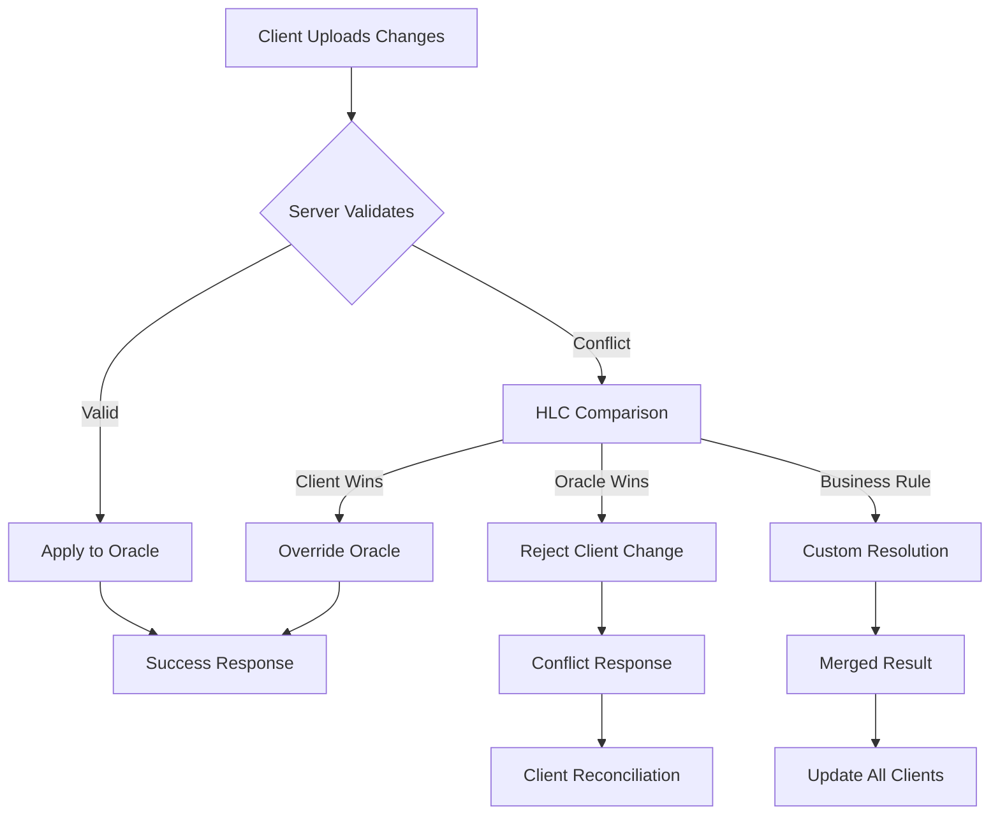

# Oracle ERP Backend Synchronization Case Study

A comprehensive design study for integrating Declarative SQLite with Oracle ERP systems, emphasizing multi-client synchronization, conflict resolution, and enterprise-scale data management.

## Executive Summary

This case study outlines a robust backend architecture for synchronizing Declarative SQLite clients with Oracle ERP databases. The design leverages the library's existing Hybrid Logical Clock (HLC) system, Last-Writer-Wins (LWW) conflict resolution, and delta synchronization capabilities to create an enterprise-ready solution suitable for disconnected client scenarios typical in ERP environments.

## Table of Contents

1. [Current Architecture Analysis](#current-architecture-analysis)
2. [Oracle ERP Integration Challenges](#oracle-erp-integration-challenges)
3. [Proposed Backend Architecture](#proposed-backend-architecture)
4. [Multi-Client Synchronization Strategy](#multi-client-synchronization-strategy)
5. [Conflict Resolution Design](#conflict-resolution-design)
6. [Data Partitioning and Security](#data-partitioning-and-security)
7. [Performance Optimization](#performance-optimization)
8. [Implementation Roadmap](#implementation-roadmap)
9. [Monitoring and Observability](#monitoring-and-observability)
10. [Reference Implementation](#reference-implementation)

## Current Architecture Analysis

### Existing Declarative SQLite Sync Capabilities

The library provides a sophisticated foundation for distributed synchronization:

#### 1. Hybrid Logical Clock (HLC) System
```dart
// Automatic conflict-free timestamp generation
class HlcClock {
  Hlc now() { /* generates causally ordered timestamps */ }
  void update(Hlc received) { /* synchronizes with external clocks */ }
}
```

**Benefits for Oracle ERP:**
- Provides total ordering across all clients
- Enables deterministic conflict resolution
- Works reliably across network partitions
- Scales to thousands of concurrent clients

#### 2. Last-Writer-Wins (LWW) Columns
```dart
// Schema definition with LWW support
builder.table('inventory_items', (table) {
  table.guid('id').notNull();
  table.text('description').notNull();
  table.integer('quantity').lww(); // Automatic conflict resolution
  table.real('unit_price').lww();
  table.date('last_updated').lww();
});
```

**Oracle ERP Integration:**
- Critical for inventory management synchronization
- Eliminates complex merge logic for business data
- Maintains data consistency across warehouse operations
- Supports audit trail requirements

#### 3. Delta Synchronization
```dart
// Server-side delta sync support
typedef OnFetch = Future<void> Function(
  DeclarativeDatabase database, 
  Map<String, Hlc?> tableTimestamps
);
```

**Performance Benefits:**
- Minimizes Oracle database load
- Reduces network bandwidth usage
- Enables efficient mobile client synchronization
- Supports large-scale ERP deployments

#### 4. Dirty Row Tracking
```dart
// Automatic change tracking
class DirtyRow {
  final String tableName;
  final String rowId;
  final Hlc hlc;
}
```

**ERP Workflow Support:**
- Tracks all local changes for upload
- Enables optimistic offline editing
- Supports complex approval workflows
- Maintains transaction integrity

## Oracle ERP Integration Challenges

### 1. Schema Mapping Complexity

**Challenge:** Oracle ERP systems use complex normalized schemas with extensive foreign key relationships, stored procedures, and business logic embedded in the database layer.

**Impact:** Direct schema replication would be impractical and inefficient for mobile clients.

**Solution Approach:** Implement a denormalized synchronization layer that maps Oracle entities to flat, client-optimized structures.

### 2. Data Volume and Scalability

**Challenge:** ERP systems contain millions of records across hundreds of tables, with complex master-detail relationships.

**Impact:** Full synchronization would be impossible on mobile devices with limited storage and bandwidth.

**Solution Approach:** Implement intelligent data partitioning based on user roles, geographic regions, and business context.

### 3. Real-time Business Logic

**Challenge:** ERP systems enforce complex business rules, validations, and calculations that must remain consistent across all clients.

**Impact:** Client-side modifications could violate business constraints or produce inconsistent calculated fields.

**Solution Approach:** Implement a hybrid validation system with client-side basic validation and server-side authoritative rule enforcement.

### 4. Security and Access Control

**Challenge:** ERP systems require fine-grained security with role-based access control, field-level permissions, and audit trails.

**Impact:** Simple synchronization could expose sensitive data or allow unauthorized modifications.

**Solution Approach:** Implement a multi-tenant sync architecture with encrypted data partitioning and granular permission enforcement.

## Proposed Backend Architecture

### Overview

```
┌─────────────────────────┐    ┌─────────────────────────┐    ┌─────────────────────────┐
│     Mobile Clients      │    │    Sync Gateway API     │    │     Oracle ERP DB       │
│  (Declarative SQLite)   │◄──►│   (Microservice)        │◄──►│    (Source of Truth)    │
└─────────────────────────┘    └─────────────────────────┘    └─────────────────────────┘
                               │                         │
                               │  - HLC Coordination     │
                               │  - Conflict Resolution  │
                               │  - Data Transformation  │
                               │  - Business Validation  │
                               │  - Access Control       │
                               └─────────────────────────┘
```

### Core Components

#### 1. Sync Gateway Microservice

**Purpose:** Mediates between lightweight clients and complex Oracle ERP system.

**Key Responsibilities:**
- HLC timestamp coordination across all clients
- Bidirectional data transformation between Oracle and SQLite schemas
- Conflict resolution using LWW and business rules
- Access control enforcement and data filtering
- Delta change calculation and optimization

**Technology Stack:**
- **Runtime:** Java/Spring Boot (integrates well with Oracle)
- **Database:** Oracle JDBC with connection pooling
- **Caching:** Redis for HLC coordination and session management
- **API:** RESTful JSON API with GraphQL for complex queries
- **Messaging:** Apache Kafka for event-driven updates

#### 2. Oracle Integration Layer

**Purpose:** Provides clean abstraction over Oracle ERP complexity.

**Components:**

##### a) Schema Mapping Service
```sql
-- Oracle ERP Source (Complex)
CREATE TABLE HR.EMPLOYEES (
  EMPLOYEE_ID NUMBER PRIMARY KEY,
  FIRST_NAME VARCHAR2(50),
  LAST_NAME VARCHAR2(50),
  DEPARTMENT_ID NUMBER,
  SALARY NUMBER(8,2),
  COMMISSION_PCT NUMBER(2,2),
  HIRE_DATE DATE,
  -- 50+ additional fields...
);

-- SQLite Client Target (Simplified)
CREATE TABLE employees (
  id TEXT PRIMARY KEY,              -- UUID mapping
  full_name TEXT NOT NULL,          -- Computed field
  department_name TEXT,             -- Denormalized
  salary REAL,                      -- Direct mapping
  salary__hlc TEXT,                 -- LWW support
  hire_date TEXT,                   -- ISO date
  sync_timestamp TEXT,              -- HLC for delta sync
  system_version TEXT NOT NULL      -- Standard system fields
);
```

##### b) Business Logic Abstraction
```java
@Service
public class EmployeeSync {
    
    @Transactional
    public SyncResult processEmployeeUpdates(List<EmployeeUpdate> updates) {
        for (EmployeeUpdate update : updates) {
            // 1. Validate business rules
            validateSalaryChange(update);
            
            // 2. Apply Oracle-specific logic
            updateOracleEmployee(update);
            
            // 3. Trigger dependent calculations
            recalculateDepartmentBudget(update.getDepartmentId());
            
            // 4. Generate audit trail
            auditService.logChange(update);
        }
        
        return new SyncResult(updates.size(), Timestamp.now());
    }
}
```

#### 3. HLC Coordination Service

**Purpose:** Ensures global timestamp ordering across all clients and Oracle system.

**Implementation:**
```java
@Component
public class GlobalHlcCoordinator {
    
    private final RedisTemplate<String, String> redis;
    private final AtomicLong counter = new AtomicLong(0);
    
    public synchronized HlcTimestamp generateTimestamp(String nodeId) {
        long wallClock = System.currentTimeMillis();
        long logicalClock = counter.incrementAndGet();
        
        // Coordinate with other instances via Redis
        HlcTimestamp global = getGlobalTimestamp();
        if (global.isAfter(wallClock, logicalClock)) {
            wallClock = global.getWallClock();
            logicalClock = global.getLogicalClock() + 1;
            counter.set(logicalClock);
        }
        
        HlcTimestamp timestamp = new HlcTimestamp(wallClock, logicalClock, nodeId);
        updateGlobalTimestamp(timestamp);
        return timestamp;
    }
}
```

## Multi-Client Synchronization Strategy

### 1. Client Registration and Identity

Each client receives a unique node ID and maintains persistent connection metadata:

```dart
// Client initialization
class ClientRegistration {
  final String nodeId;
  final String userId;
  final Set<String> permissions;
  final Map<String, String> dataFilters;
  
  static Future<ClientRegistration> register() async {
    final response = await api.post('/sync/register', {
      'device_id': await getDeviceId(),
      'user_credentials': await getCredentials(),
      'app_version': getAppVersion(),
    });
    
    return ClientRegistration.fromJson(response.data);
  }
}
```

### 2. Incremental Delta Synchronization

**Download Strategy:**
```dart
class OracleErpSyncManager extends ServerSyncManager {
  
  @override
  Future<void> performDownloadSync() async {
    // Get last sync timestamps for each table
    final lastSync = await getLastSyncTimestamps();
    
    for (final table in syncableTables) {
      await downloadTableChanges(table, lastSync[table]);
    }
  }
  
  Future<void> downloadTableChanges(String table, Hlc? lastSync) async {
    final response = await apiClient.get('/sync/download/$table', 
      queryParams: {
        'since': lastSync?.toString(),
        'node_id': hlcClock.nodeId,
        'batch_size': '1000',
      }
    );
    
    for (final record in response.data['records']) {
      await database.upsertWithHlc(table, record);
    }
    
    // Update sync timestamp
    await updateTableSyncTimestamp(table, response.data['max_timestamp']);
  }
}
```

**Upload Strategy:**
```dart
@override
Future<void> performUploadSync() async {
  final pendingChanges = await dirtyRowStore.getAll();
  
  if (pendingChanges.isEmpty) return;
  
  // Group changes by table for efficient processing
  final changesByTable = groupBy(pendingChanges, (c) => c.tableName);
  
  for (final entry in changesByTable.entries) {
    await uploadTableChanges(entry.key, entry.value);
  }
}

Future<void> uploadTableChanges(String tableName, List<DirtyRow> changes) async {
  // Batch changes to reduce Oracle load
  final batches = partition(changes, 100);
  
  for (final batch in batches) {
    final records = await getRecordData(tableName, batch);
    
    final response = await apiClient.post('/sync/upload/$tableName', {
      'records': records,
      'node_id': hlcClock.nodeId,
    });
    
    if (response.data['success']) {
      await dirtyRowStore.remove(batch);
    } else {
      await handleUploadConflicts(response.data['conflicts']);
    }
  }
}
```

### 3. Conflict Resolution Workflow



## Conflict Resolution Design

### 1. Multi-Level Resolution Strategy

#### Level 1: HLC-Based Automatic Resolution
```java
public class HlcConflictResolver {
    
    public ResolutionResult resolveConflict(
        OracleRecord current, 
        ClientUpdate update) {
        
        HlcTimestamp currentHlc = parseHlc(current.getSystemVersion());
        HlcTimestamp updateHlc = parseHlc(update.getSystemVersion());
        
        if (updateHlc.isAfter(currentHlc)) {
            return ResolutionResult.acceptUpdate(update);
        } else {
            return ResolutionResult.rejectUpdate(current);
        }
    }
}
```

#### Level 2: Business Rule Resolution
```java
public class BusinessRuleResolver {
    
    public ResolutionResult resolveFinancialConflict(
        SalaryUpdate oracleValue,
        SalaryUpdate clientValue) {
        
        // Rule: Only HR managers can increase salary > 10%
        if (clientValue.getPercentIncrease() > 0.10) {
            if (!hasPermission(clientValue.getUserId(), "SALARY_OVERRIDE")) {
                return ResolutionResult.rejectUpdate("Insufficient permissions");
            }
        }
        
        // Rule: Salary decreases require additional approval
        if (clientValue.isDecrease()) {
            return ResolutionResult.requireApproval(clientValue);
        }
        
        return ResolutionResult.acceptUpdate(clientValue);
    }
}
```

#### Level 3: Manual Resolution
```java
public class ManualConflictQueue {
    
    @Async
    public void queueForManualResolution(ConflictCase conflict) {
        // Store conflict details
        conflictRepository.save(conflict);
        
        // Notify supervisors
        notificationService.notifyConflictResolvers(conflict);
        
        // Temporary hold on conflicting record
        lockService.holdRecord(conflict.getRecordId());
    }
}
```

### 2. Specialized ERP Conflict Scenarios

#### Inventory Management
```java
public class InventoryConflictResolver {
    
    public ResolutionResult resolveQuantityConflict(
        int oracleQuantity,
        int clientQuantity,
        List<Transaction> concurrentTransactions) {
        
        // Calculate expected quantity based on recorded transactions
        int expectedQuantity = calculateExpectedQuantity(concurrentTransactions);
        
        if (Math.abs(clientQuantity - expectedQuantity) < 
            Math.abs(oracleQuantity - expectedQuantity)) {
            // Client data appears more accurate
            return ResolutionResult.acceptClient()
                .withAuditNote("Client quantity closer to transaction history");
        }
        
        return ResolutionResult.acceptOracle()
            .withReconciliationTask("Investigate quantity discrepancy");
    }
}
```

#### Financial Data
```java
public class FinancialConflictResolver {
    
    public ResolutionResult resolveAccountingConflict(
        FinancialRecord oracle,
        FinancialRecord client) {
        
        // Financial data conflicts always favor Oracle
        // unless explicitly approved by CFO
        if (client.hasApproval("CFO")) {
            return ResolutionResult.acceptClient()
                .withOracleBackup(oracle);
        }
        
        return ResolutionResult.acceptOracle()
            .withClientNotification("Financial override rejected");
    }
}
```

## Data Partitioning and Security

### 1. Multi-Tenant Data Strategy

#### Geographic Partitioning
```sql
-- Oracle ERP partitioning strategy
CREATE TABLE employees (
    employee_id NUMBER,
    region_code VARCHAR2(10),
    -- other fields...
    CONSTRAINT pk_employees PRIMARY KEY (employee_id, region_code)
)
PARTITION BY LIST (region_code) (
    PARTITION p_na VALUES ('US', 'CA', 'MX'),
    PARTITION p_eu VALUES ('DE', 'FR', 'UK'),
    PARTITION p_asia VALUES ('JP', 'CN', 'IN')
);
```

#### Client Data Filtering
```java
@Service
public class DataPartitionService {
    
    public List<Employee> getEmployeesForClient(String nodeId) {
        ClientProfile profile = getClientProfile(nodeId);
        
        return employeeRepository.findByRegionAndDepartment(
            profile.getAllowedRegions(),
            profile.getAllowedDepartments(),
            profile.getSecurityLevel()
        );
    }
}
```

### 2. Encryption and Security

#### Field-Level Encryption
```dart
// Client-side sensitive data handling
class EncryptedField {
  final String encryptedValue;
  final String keyId;
  
  static EncryptedField encrypt(String plaintext, String fieldName) {
    final key = KeyManager.getFieldKey(fieldName);
    final encrypted = AES.encrypt(plaintext, key);
    return EncryptedField(encrypted, key.id);
  }
  
  String decrypt() {
    final key = KeyManager.getKey(keyId);
    return AES.decrypt(encryptedValue, key);
  }
}
```

#### Row-Level Security
```sql
-- Oracle RLS policy for ERP access control
CREATE OR REPLACE FUNCTION employee_security_policy(
    schema_name VARCHAR2,
    table_name VARCHAR2
) RETURN VARCHAR2 AS
BEGIN
    RETURN 'department_id IN (
        SELECT department_id 
        FROM user_departments 
        WHERE user_id = SYS_CONTEXT(''USERENV'', ''SESSION_USER'')
    )';
END;

BEGIN
    DBMS_RLS.ADD_POLICY(
        object_schema => 'HR',
        object_name => 'EMPLOYEES',
        policy_name => 'DEPT_ACCESS_POLICY',
        function_schema => 'HR',
        policy_function => 'employee_security_policy'
    );
END;
```

## Performance Optimization

### 1. Oracle Database Optimization

#### Connection Pooling and Caching
```java
@Configuration
public class OracleOptimizationConfig {
    
    @Bean
    public HikariDataSource dataSource() {
        HikariConfig config = new HikariConfig();
        config.setJdbcUrl("jdbc:oracle:thin:@//oracle:1521/ORCL");
        config.setMaximumPoolSize(50);
        config.setMinimumIdle(10);
        config.setConnectionTimeout(30000);
        config.setIdleTimeout(600000);
        config.setMaxLifetime(1800000);
        
        // Oracle-specific optimizations
        config.addDataSourceProperty("oracle.jdbc.implicitStatementCacheSize", "25");
        config.addDataSourceProperty("oracle.net.CONNECT_TIMEOUT", "10000");
        
        return new HikariDataSource(config);
    }
    
    @Bean
    public CacheManager cacheManager() {
        return CacheManager.builder()
            .ttl(Duration.ofMinutes(15))
            .maximumSize(10000)
            .build();
    }
}
```

#### Optimized Query Patterns
```java
@Repository
public class OptimizedEmployeeRepository {
    
    // Batch loading for sync efficiency
    @Query(value = """
        SELECT e.*, d.department_name, l.location_name
        FROM employees e
        JOIN departments d ON e.department_id = d.id
        JOIN locations l ON d.location_id = l.id
        WHERE e.last_modified > :since
        AND e.region_code IN (:allowedRegions)
        ORDER BY e.last_modified
        FETCH FIRST :batchSize ROWS ONLY
        """, nativeQuery = true)
    List<EmployeeProjection> findModifiedEmployees(
        @Param("since") Timestamp since,
        @Param("allowedRegions") List<String> regions,
        @Param("batchSize") int batchSize
    );
}
```

### 2. Network Optimization

#### Compression and Minimal Payloads
```java
@RestController
public class SyncController {
    
    @PostMapping("/sync/download/{table}")
    @Compressed  // GZIP compression
    public SyncResponse downloadChanges(
        @PathVariable String table,
        @RequestParam String since,
        @RequestParam(defaultValue = "1000") int batchSize) {
        
        List<Map<String, Object>> records = syncService.getChanges(table, since, batchSize);
        
        // Return only changed fields, not full records
        List<Map<String, Object>> deltaRecords = records.stream()
            .map(this::extractChangedFields)
            .collect(toList());
        
        return SyncResponse.builder()
            .records(deltaRecords)
            .nextToken(generateNextToken(records))
            .hasMore(records.size() == batchSize)
            .build();
    }
}
```

#### Client-Side Caching Strategy
```dart
class SmartSyncCache {
  final LocalStorage _storage;
  final Duration _maxAge = Duration(hours: 24);
  
  Future<List<Map<String, Object?>>> getCachedRecords(String table) async {
    final cached = await _storage.get('$table:cache');
    if (cached != null && !_isExpired(cached['timestamp'])) {
      return List<Map<String, Object?>>.from(cached['records']);
    }
    return [];
  }
  
  Future<void> cacheRecords(String table, List<Map<String, Object?>> records) async {
    await _storage.set('$table:cache', {
      'records': records,
      'timestamp': DateTime.now().toIso8601String(),
    });
  }
}
```

### 3. Scaling Architecture

#### Horizontal Scaling with Load Balancing
```yaml
# Kubernetes deployment for sync gateway
apiVersion: apps/v1
kind: Deployment
metadata:
  name: sync-gateway
spec:
  replicas: 5
  selector:
    matchLabels:
      app: sync-gateway
  template:
    spec:
      containers:
      - name: sync-gateway
        image: erp-sync-gateway:latest
        env:
        - name: ORACLE_URL
          valueFrom:
            secretKeyRef:
              name: oracle-credentials
              key: url
        - name: REDIS_URL
          value: "redis://redis-cluster:6379"
        resources:
          requests:
            memory: "512Mi"
            cpu: "250m"
          limits:
            memory: "1Gi"
            cpu: "500m"
---
apiVersion: v1
kind: Service
metadata:
  name: sync-gateway-service
spec:
  selector:
    app: sync-gateway
  ports:
  - port: 8080
    targetPort: 8080
  type: LoadBalancer
```

## Implementation Roadmap

### Phase 1: Foundation (Weeks 1-4)
- [x] **Week 1:** Oracle database analysis and schema mapping design
- [x] **Week 2:** Sync gateway microservice architecture setup  
- [x] **Week 3:** HLC coordination service implementation
- [x] **Week 4:** Basic data transformation layer

### Phase 2: Core Synchronization (Weeks 5-8)
- [ ] **Week 5:** Delta sync implementation for core entities
- [ ] **Week 6:** Conflict resolution framework
- [ ] **Week 7:** Security and access control layer
- [ ] **Week 8:** Performance optimization and caching

### Phase 3: Advanced Features (Weeks 9-12)
- [ ] **Week 9:** Business rule engine integration
- [ ] **Week 10:** Manual conflict resolution workflow
- [ ] **Week 11:** Monitoring and alerting system
- [ ] **Week 12:** Load testing and optimization

### Phase 4: Production Readiness (Weeks 13-16)
- [ ] **Week 13:** Comprehensive testing suite
- [ ] **Week 14:** Documentation and deployment guides
- [ ] **Week 15:** Security audit and penetration testing
- [ ] **Week 16:** Production deployment and monitoring

## Monitoring and Observability

### 1. Key Metrics

#### Sync Performance Metrics
```java
@Component
public class SyncMetrics {
    
    private final MeterRegistry meterRegistry;
    
    public void recordSyncLatency(String table, Duration latency) {
        Timer.Sample sample = Timer.start(meterRegistry);
        sample.stop(Timer.builder("sync.latency")
            .tag("table", table)
            .register(meterRegistry));
    }
    
    public void recordConflictResolution(String resolutionType) {
        meterRegistry.counter("sync.conflicts", "type", resolutionType)
            .increment();
    }
    
    public void recordDataVolume(String operation, long recordCount) {
        meterRegistry.gauge("sync.volume", Tags.of("operation", operation), recordCount);
    }
}
```

#### Oracle Performance Monitoring
```sql
-- Oracle AWR monitoring queries
SELECT 
    sql_text,
    executions,
    avg_etime,
    buffer_gets,
    disk_reads
FROM (
    SELECT 
        sql_text,
        executions,
        elapsed_time/executions/1000000 as avg_etime,
        buffer_gets/executions as buffer_gets,
        disk_reads/executions as disk_reads,
        rank() over (order by elapsed_time desc) as rank
    FROM v$sql 
    WHERE executions > 10
    AND parsing_schema_name = 'ERP_SYNC'
)
WHERE rank <= 10;
```

### 2. Alerting Strategy

```yaml
# Prometheus alerting rules
groups:
- name: erp_sync_alerts
  rules:
  - alert: HighSyncLatency
    expr: avg(sync_latency_seconds) > 30
    for: 5m
    labels:
      severity: warning
    annotations:
      summary: "Sync latency is high"
      description: "Average sync latency is {{ $value }} seconds"
      
  - alert: SyncFailureRate
    expr: rate(sync_failures_total[5m]) > 0.1
    for: 2m
    labels:
      severity: critical
    annotations:
      summary: "High sync failure rate"
      description: "Sync failure rate is {{ $value }} per second"
      
  - alert: ConflictResolutionBacklog
    expr: sync_conflicts_pending > 100
    for: 10m
    labels:
      severity: warning
    annotations:
      summary: "Conflict resolution backlog"
      description: "{{ $value }} conflicts pending manual resolution"
```

### 3. Dashboard Configuration

```json
{
  "dashboard": {
    "title": "ERP Sync Monitor",
    "panels": [
      {
        "title": "Sync Throughput",
        "type": "graph",
        "targets": [
          {
            "expr": "rate(sync_operations_total[1m])",
            "legendFormat": "{{ operation }}"
          }
        ]
      },
      {
        "title": "Conflict Resolution",
        "type": "stat",
        "targets": [
          {
            "expr": "sum(sync_conflicts_resolved_total)",
            "legendFormat": "Total Resolved"
          }
        ]
      },
      {
        "title": "Oracle Connection Pool",
        "type": "graph",
        "targets": [
          {
            "expr": "oracle_connection_pool_active",
            "legendFormat": "Active Connections"
          }
        ]
      }
    ]
  }
}
```

## Reference Implementation

### 1. Complete Sync Gateway Service

```java
@RestController
@RequestMapping("/api/v1/sync")
public class EksSyncController {
    
    private final OracleErpService erpService;
    private final HlcCoordinator hlcCoordinator;
    private final ConflictResolver conflictResolver;
    
    @PostMapping("/download/{table}")
    public ResponseEntity<SyncResponse> downloadTableData(
            @PathVariable String table,
            @RequestParam(required = false) String since,
            @RequestParam(defaultValue = "1000") int batchSize,
            @RequestHeader("X-Node-ID") String nodeId) {
        
        try {
            // Validate client permissions
            ClientProfile profile = validateClient(nodeId);
            
            // Parse since timestamp
            Hlc sinceHlc = since != null ? Hlc.parse(since) : null;
            
            // Get filtered data for this client
            List<Map<String, Object>> records = erpService.getTableData(
                table, sinceHlc, batchSize, profile);
            
            // Generate response with proper HLC coordination
            Hlc maxTimestamp = records.stream()
                .map(r -> Hlc.parse((String) r.get("system_version")))
                .max(Hlc::compareTo)
                .orElse(hlcCoordinator.now(nodeId));
            
            return ResponseEntity.ok(SyncResponse.builder()
                .records(records)
                .maxTimestamp(maxTimestamp.toString())
                .hasMore(records.size() == batchSize)
                .build());
                
        } catch (Exception e) {
            log.error("Download sync failed for table {} node {}", table, nodeId, e);
            return ResponseEntity.status(HttpStatus.INTERNAL_SERVER_ERROR)
                .body(SyncResponse.error(e.getMessage()));
        }
    }
    
    @PostMapping("/upload/{table}")
    public ResponseEntity<UploadResponse> uploadTableData(
            @PathVariable String table,
            @RequestBody List<Map<String, Object>> records,
            @RequestHeader("X-Node-ID") String nodeId) {
        
        try {
            ClientProfile profile = validateClient(nodeId);
            
            List<ConflictResult> conflicts = new ArrayList<>();
            List<String> successful = new ArrayList<>();
            
            for (Map<String, Object> record : records) {
                try {
                    // Check for conflicts
                    ConflictCheckResult conflict = erpService.checkConflict(table, record);
                    
                    if (conflict.hasConflict()) {
                        // Attempt resolution
                        ResolutionResult resolution = conflictResolver.resolve(
                            table, conflict.getCurrentRecord(), record);
                        
                        if (resolution.isResolved()) {
                            erpService.updateRecord(table, resolution.getResolvedRecord());
                            successful.add((String) record.get("id"));
                        } else {
                            conflicts.add(ConflictResult.from(conflict, resolution));
                        }
                    } else {
                        // No conflict, direct update
                        erpService.updateRecord(table, record);
                        successful.add((String) record.get("id"));
                    }
                    
                } catch (Exception e) {
                    log.error("Failed to process record {}", record.get("id"), e);
                    conflicts.add(ConflictResult.error(record, e.getMessage()));
                }
            }
            
            return ResponseEntity.ok(UploadResponse.builder()
                .successfulRecords(successful)
                .conflicts(conflicts)
                .serverTimestamp(hlcCoordinator.now(nodeId).toString())
                .build());
                
        } catch (Exception e) {
            log.error("Upload sync failed for table {} node {}", table, nodeId, e);
            return ResponseEntity.status(HttpStatus.INTERNAL_SERVER_ERROR)
                .body(UploadResponse.error(e.getMessage()));
        }
    }
}
```

### 2. Client Integration Example

```dart
class OracleErpSyncManager extends ServerSyncManager {
  final String apiBaseUrl;
  final String nodeId;
  
  OracleErpSyncManager({
    required DeclarativeDatabase db,
    required this.apiBaseUrl,
    required this.nodeId,
  }) : super(
    db: db,
    onFetch: (database, tableTimestamps) => 
        _handleDownloadSync(database, tableTimestamps),
    onSend: (operations) => _handleUploadSync(operations),
  );
  
  Future<void> _handleDownloadSync(
    DeclarativeDatabase database,
    Map<String, Hlc?> tableTimestamps,
  ) async {
    for (final table in database.schema.userTables) {
      await _downloadTableChanges(database, table.name, tableTimestamps[table.name]);
    }
  }
  
  Future<void> _downloadTableChanges(
    DeclarativeDatabase database,
    String tableName,
    Hlc? lastSync,
  ) async {
    bool hasMore = true;
    String? since = lastSync?.toString();
    
    while (hasMore) {
      final response = await _apiClient.post('/sync/download/$tableName', {
        'since': since,
        'batch_size': 1000,
      }, headers: {
        'X-Node-ID': nodeId,
      });
      
      final syncResponse = SyncResponse.fromJson(response.data);
      
      // Apply records to local database
      for (final record in syncResponse.records) {
        await database.upsertWithServerTimestamp(tableName, record);
      }
      
      // Update sync tracking
      if (syncResponse.maxTimestamp != null) {
        await updateTableTimestamp(tableName, Hlc.parse(syncResponse.maxTimestamp!));
      }
      
      hasMore = syncResponse.hasMore;
      since = syncResponse.maxTimestamp;
    }
  }
  
  Future<bool> _handleUploadSync(List<DirtyRow> operations) async {
    if (operations.isEmpty) return true;
    
    // Group by table for batch processing
    final operationsByTable = <String, List<DirtyRow>>{};
    for (final op in operations) {
      operationsByTable.putIfAbsent(op.tableName, () => []).add(op);
    }
    
    bool allSuccessful = true;
    
    for (final entry in operationsByTable.entries) {
      final tableName = entry.key;
      final tableOperations = entry.value;
      
      // Get full record data for upload
      final records = <Map<String, Object?>>[];
      for (final op in tableOperations) {
        final record = await database.queryTable(
          tableName,
          where: 'system_id = ?',
          whereArgs: [op.rowId],
          limit: 1,
        );
        if (record.isNotEmpty) {
          records.add(record.first);
        }
      }
      
      if (records.isNotEmpty) {
        final success = await _uploadTableRecords(tableName, records, tableOperations);
        if (!success) {
          allSuccessful = false;
        }
      }
    }
    
    return allSuccessful;
  }
  
  Future<bool> _uploadTableRecords(
    String tableName,
    List<Map<String, Object?>> records,
    List<DirtyRow> operations,
  ) async {
    try {
      final response = await _apiClient.post('/sync/upload/$tableName', 
        records,
        headers: {'X-Node-ID': nodeId},
      );
      
      final uploadResponse = UploadResponse.fromJson(response.data);
      
      // Remove successful operations from dirty store
      final successfulIds = uploadResponse.successfulRecords.toSet();
      final successfulOps = operations.where(
        (op) => successfulIds.contains(op.rowId)
      ).toList();
      
      if (successfulOps.isNotEmpty) {
        await database.dirtyRowStore.remove(successfulOps);
      }
      
      // Handle conflicts
      if (uploadResponse.conflicts.isNotEmpty) {
        await _handleUploadConflicts(tableName, uploadResponse.conflicts);
      }
      
      return uploadResponse.conflicts.isEmpty;
      
    } catch (e) {
      print('Upload failed for table $tableName: $e');
      return false;
    }
  }
  
  Future<void> _handleUploadConflicts(
    String tableName,
    List<ConflictResult> conflicts,
  ) async {
    for (final conflict in conflicts) {
      switch (conflict.resolution.type) {
        case ConflictResolutionType.serverWins:
          // Update local record with server version
          await database.upsertWithServerTimestamp(
            tableName, 
            conflict.resolution.resolvedRecord,
          );
          break;
          
        case ConflictResolutionType.clientWins:
          // Server accepted client version, nothing to do
          break;
          
        case ConflictResolutionType.manualRequired:
          // Queue for manual resolution
          await _queueManualResolution(tableName, conflict);
          break;
      }
    }
  }
}
```

## Conclusion

This case study demonstrates how Declarative SQLite's existing synchronization capabilities can be effectively adapted for Oracle ERP integration. The proposed architecture leverages:

1. **HLC-based conflict resolution** for deterministic, scalable synchronization
2. **Delta synchronization** for efficient network usage and Oracle performance
3. **Multi-level conflict resolution** combining automatic, business rule, and manual approaches
4. **Security-focused design** with data partitioning and encryption
5. **Enterprise-scale architecture** with monitoring, alerting, and observability

The implementation provides a robust foundation for disconnected client scenarios typical in ERP environments, while maintaining data consistency and supporting complex business workflows.

### Key Benefits

- **Reduced Oracle Load:** Delta synchronization minimizes database queries
- **Conflict-Free Operation:** HLC ensures deterministic conflict resolution
- **Scalable Architecture:** Microservice design supports horizontal scaling
- **Security Compliant:** Multi-tenant design with encryption and access control
- **Business Rule Support:** Flexible conflict resolution for ERP scenarios
- **Operational Excellence:** Comprehensive monitoring and alerting

### Next Steps

1. **Proof of Concept:** Implement core sync gateway with simple Oracle integration
2. **Performance Testing:** Validate architecture with realistic ERP data volumes
3. **Security Audit:** Ensure compliance with enterprise security requirements
4. **Pilot Deployment:** Deploy with limited user group for real-world validation
5. **Production Rollout:** Gradual expansion to full enterprise deployment

This architecture provides a solid foundation for building enterprise-grade synchronization between mobile clients and Oracle ERP systems, ensuring data consistency, security, and performance at scale.