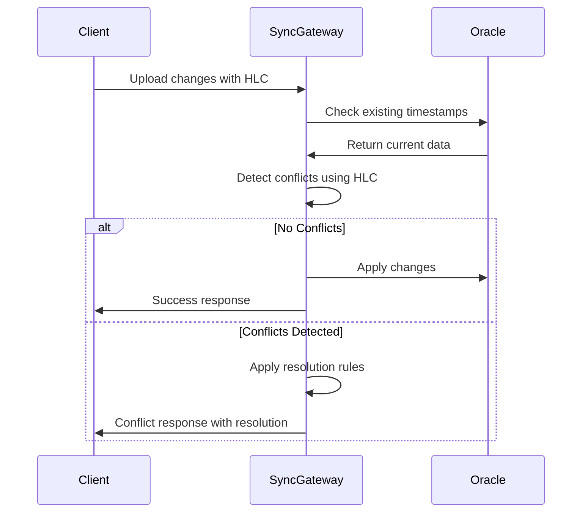

# Oracle ERP Backend - Design Patterns and Best Practices

This document distills the key design patterns, architectural decisions, and best practices from the comprehensive case study for Oracle ERP integration with Declarative SQLite.

## Table of Contents

1. [Core Design Patterns](#core-design-patterns)
2. [Synchronization Strategies](#synchronization-strategies)
3. [Conflict Resolution Patterns](#conflict-resolution-patterns)
4. [Security and Access Control](#security-and-access-control)
5. [Performance Optimization](#performance-optimization)
6. [Operational Excellence](#operational-excellence)
7. [Implementation Guidelines](#implementation-guidelines)

## Core Design Patterns

### 1. Hybrid Logical Clock (HLC) Coordination Pattern

**Problem:** Ensuring consistent ordering of events across distributed clients and Oracle ERP system.

**Solution:** Centralized HLC coordination with Redis-based synchronization.

```java
// Singleton HLC coordinator ensuring global ordering
@Component
public class GlobalHlcCoordinator {
    
    // Central authority for timestamp generation
    public synchronized HlcTimestamp generateTimestamp(String nodeId) {
        // 1. Get current physical time
        // 2. Coordinate with global state
        // 3. Apply HLC rules
        // 4. Update global state atomically
        return newTimestamp;
    }
    
    // External system integration
    public void syncWithOracle(HlcTimestamp oracleTimestamp) {
        // Update global clock when Oracle provides timestamps
        updateGlobalState(oracleTimestamp);
    }
}
```

**Key Benefits:**
- Deterministic conflict resolution
- Total ordering across all clients
- Works during network partitions
- Integrates with existing Oracle audit fields

### 2. Schema Mapping and Transformation Pattern

**Problem:** Oracle ERP schemas are complex and normalized, while mobile clients need simple, denormalized structures.

**Solution:** Declarative mapping layer with bidirectional transformations.

```java
// Configuration-driven schema mapping
@Bean
public SchemaMapper oracleSchemaMapper() {
    return SchemaMapper.builder()
        .addMapping("employees", OracleTableMapping.builder()
            // Source table with joins
            .oracleTable("HR.EMPLOYEES e")
            .addJoin("LEFT JOIN HR.DEPARTMENTS d ON e.DEPARTMENT_ID = d.ID")
            
            // Field transformations
            .addField("id", "e.EMPLOYEE_ID", FieldTransform.guidToNumber())
            .addField("full_name", "e.FIRST_NAME || ' ' || e.LAST_NAME", FieldTransform.computed())
            .addField("department_name", "d.DEPARTMENT_NAME", FieldTransform.joined())
            
            // Security and filtering
            .regionColumn("e.REGION_CODE")
            .securityFilter(profile -> buildSecurityPredicate(profile))
            
            .build())
        .build();
}
```

**Key Benefits:**
- Clean separation of concerns
- Maintains Oracle referential integrity
- Supports complex business logic
- Enables security filtering at database level

### 3. Multi-Level Conflict Resolution Pattern

**Problem:** Different types of conflicts require different resolution strategies.

**Solution:** Hierarchical resolution with escalation paths.

```java
// Conflict resolution chain of responsibility
public class ConflictResolutionChain {
    
    public ResolutionResult resolve(ConflictCase conflict) {
        // Level 1: Automatic HLC-based resolution
        ResolutionResult hlcResult = hlcResolver.resolve(conflict);
        if (hlcResult.isResolved()) return hlcResult;
        
        // Level 2: Business rule resolution
        ResolutionResult businessResult = businessRuleResolver.resolve(conflict);
        if (businessResult.isResolved()) return businessResult;
        
        // Level 3: Manual resolution queue
        return manualResolutionQueue.queue(conflict);
    }
}
```

**Resolution Hierarchy:**
1. **HLC-based**: Automatic timestamp comparison
2. **Business Rules**: Domain-specific logic (salary caps, approval workflows)
3. **Manual Queue**: Human intervention for complex cases

### 4. Secure Multi-Tenant Data Pattern

**Problem:** Different clients need access to different subsets of ERP data based on roles and geography.

**Solution:** Data partitioning with encryption and row-level security.

```java
// Security-aware data access
public class SecureDataAccess {
    
    public List<Record> getDataForClient(String table, ClientProfile profile) {
        // 1. Apply geographic filters
        QueryBuilder query = queryBuilder(table)
            .whereIn("region_code", profile.getAllowedRegions());
        
        // 2. Apply role-based filters
        if (!profile.hasRole("GLOBAL_ADMIN")) {
            query.whereIn("department_id", profile.getAllowedDepartments());
        }
        
        // 3. Apply row-level security
        query.where(buildRowSecurityPredicate(profile));
        
        // 4. Encrypt sensitive fields
        return query.execute()
            .stream()
            .map(record -> encryptSensitiveFields(record, profile))
            .collect(toList());
    }
}
```

### 5. Delta Synchronization Pattern

**Problem:** Minimizing Oracle database load and network bandwidth usage.

**Solution:** Timestamp-based delta sync with optimized batch processing.

```java
// Efficient delta synchronization
public class DeltaSyncService {
    
    public SyncBatch getChangesSince(String table, HlcTimestamp since, int batchSize) {
        // 1. Query only changed records
        String query = "SELECT * FROM " + table + 
                      " WHERE last_updated > ? " +
                      " ORDER BY last_updated " +
                      " FETCH FIRST ? ROWS ONLY";
        
        // 2. Batch processing for performance
        List<Record> records = executeQuery(query, since, batchSize + 1);
        
        // 3. Determine if more records exist
        boolean hasMore = records.size() > batchSize;
        if (hasMore) records.removeLast();
        
        return new SyncBatch(records, hasMore, getMaxTimestamp(records));
    }
}
```

## Synchronization Strategies

### 1. Bidirectional Sync with Conflict Detection



### 2. Optimistic Offline Editing

**Pattern:** Allow clients to work offline and sync when connectivity returns.

```dart
// Client-side optimistic editing
class OptimisticEditingManager {
    
    Future<void> editRecord(String table, Map<String, dynamic> changes) async {
        // 1. Apply changes locally immediately
        await database.update(table, changes);
        
        // 2. Track change for later sync
        await database.dirtyRowStore.add(table, changes['id'], hlcClock.now());
        
        // 3. Attempt immediate sync if online
        if (await connectivity.isOnline()) {
            syncManager.performSync();
        }
    }
    
    Future<void> onConnectivityRestored() async {
        // Sync all pending changes when coming back online
        await syncManager.performSync();
    }
}
```

### 3. Batch Processing for Performance

```java
// Server-side batch optimization
@Service
public class BatchSyncProcessor {
    
    @Transactional
    public BatchResult processBatch(List<RecordUpdate> updates) {
        // Group updates by type for efficient processing
        Map<UpdateType, List<RecordUpdate>> grouped = updates.stream()
            .collect(groupingBy(RecordUpdate::getType));
        
        BatchResult result = new BatchResult();
        
        // Process each type with optimized strategy
        grouped.forEach((type, records) -> {
            switch (type) {
                case INSERT:
                    result.addAll(batchInsert(records));
                    break;
                case UPDATE:
                    result.addAll(batchUpdate(records));
                    break;
                case DELETE:
                    result.addAll(batchDelete(records));
                    break;
            }
        });
        
        return result;
    }
}
```

## Conflict Resolution Patterns

### 1. Last-Writer-Wins (LWW) with Business Rules

```java
// Sophisticated LWW with business validation
public class BusinessAwareLwwResolver {
    
    public ResolutionResult resolve(String field, Object clientValue, Object serverValue, 
                                   HlcTimestamp clientHlc, HlcTimestamp serverHlc,
                                   BusinessContext context) {
        
        // Check business rules first
        ValidationResult validation = validateBusinessRules(field, clientValue, context);
        if (!validation.isValid()) {
            return ResolutionResult.reject(validation.getErrorMessage());
        }
        
        // Apply LWW if business rules pass
        if (clientHlc.isAfter(serverHlc)) {
            return ResolutionResult.accept(clientValue);
        } else {
            return ResolutionResult.reject("Server version is newer");
        }
    }
    
    private ValidationResult validateBusinessRules(String field, Object value, BusinessContext context) {
        switch (field) {
            case "salary":
                return validateSalaryChange((Double) value, context);
            case "department":
                return validateDepartmentTransfer((String) value, context);
            default:
                return ValidationResult.valid();
        }
    }
}
```

### 2. Contextual Conflict Resolution

```java
// Context-aware resolution based on ERP scenarios
public class ContextualConflictResolver {
    
    public ResolutionResult resolveInventoryConflict(InventoryUpdate client, InventoryUpdate server) {
        // For inventory, consider transaction history
        List<Transaction> recentTransactions = getRecentTransactions(client.getItemId());
        
        int expectedQuantity = calculateExpectedQuantity(recentTransactions);
        
        // Choose the value closest to expected
        if (Math.abs(client.getQuantity() - expectedQuantity) < 
            Math.abs(server.getQuantity() - expectedQuantity)) {
            return ResolutionResult.acceptClient("Client data matches transaction history");
        } else {
            return ResolutionResult.acceptServer("Server data matches transaction history");
        }
    }
    
    public ResolutionResult resolveFinancialConflict(FinancialUpdate client, FinancialUpdate server) {
        // Financial data requires special handling
        if (client.requiresApproval() && !client.hasApproval()) {
            return ResolutionResult.requireApproval("Financial change needs CFO approval");
        }
        
        // Use standard LWW for approved changes
        return standardLwwResolver.resolve(client, server);
    }
}
```

### 3. Manual Resolution Workflow

```java
// Workflow for complex conflicts requiring human intervention
@Component
public class ManualConflictWorkflow {
    
    @Async
    public void processManualConflict(ConflictCase conflict) {
        // 1. Store conflict details
        ConflictRecord record = conflictRepository.save(
            ConflictRecord.from(conflict));
        
        // 2. Determine appropriate resolver
        String resolverRole = determineResolverRole(conflict);
        List<User> resolvers = userService.getUsersByRole(resolverRole);
        
        // 3. Send notifications
        for (User resolver : resolvers) {
            notificationService.sendConflictNotification(resolver, record);
        }
        
        // 4. Lock conflicting record temporarily
        recordLockService.lockRecord(conflict.getTableName(), conflict.getRecordId());
        
        // 5. Set timeout for automatic escalation
        scheduleEscalation(record, Duration.ofHours(24));
    }
    
    @EventListener
    public void handleResolution(ConflictResolvedEvent event) {
        // Apply resolution and unlock record
        applyResolution(event.getConflictId(), event.getResolution());
        recordLockService.unlockRecord(event.getTableName(), event.getRecordId());
        
        // Notify all affected clients
        broadcastResolution(event);
    }
}
```

## Security and Access Control

### 1. Multi-Layer Security Pattern

```java
// Comprehensive security implementation
@Component
public class MultiLayerSecurity {
    
    public SecurityContext validateAccess(String nodeId, String authToken, String operation, String resource) {
        // Layer 1: Authentication
        ClientSession session = authenticationService.validateToken(authToken);
        if (session == null) throw new UnauthorizedException();
        
        // Layer 2: Node validation
        if (!session.getNodeId().equals(nodeId)) throw new SecurityException();
        
        // Layer 3: Authorization
        if (!authorizationService.hasPermission(session.getUserId(), operation, resource)) {
            throw new ForbiddenException();
        }
        
        // Layer 4: Data filtering
        DataFilter filter = buildDataFilter(session.getProfile());
        
        return SecurityContext.builder()
            .session(session)
            .dataFilter(filter)
            .auditContext(buildAuditContext(session, operation, resource))
            .build();
    }
}
```

### 2. Field-Level Encryption Pattern

```dart
// Client-side encryption for sensitive data
class FieldEncryption {
    final Map<String, EncryptionKey> _fieldKeys;
    
    Future<Map<String, dynamic>> encryptRecord(Map<String, dynamic> record, List<String> sensitiveFields) async {
        final encrypted = Map<String, dynamic>.from(record);
        
        for (final field in sensitiveFields) {
            if (encrypted.containsKey(field) && encrypted[field] != null) {
                final key = await _getFieldKey(field);
                encrypted[field] = await _encrypt(encrypted[field].toString(), key);
                encrypted['${field}_encrypted'] = true;
            }
        }
        
        return encrypted;
    }
    
    Future<Map<String, dynamic>> decryptRecord(Map<String, dynamic> record) async {
        final decrypted = Map<String, dynamic>.from(record);
        
        for (final entry in record.entries) {
            if (entry.key.endsWith('_encrypted') && entry.value == true) {
                final fieldName = entry.key.replaceAll('_encrypted', '');
                if (decrypted.containsKey(fieldName)) {
                    final key = await _getFieldKey(fieldName);
                    decrypted[fieldName] = await _decrypt(decrypted[fieldName], key);
                    decrypted.remove(entry.key);
                }
            }
        }
        
        return decrypted;
    }
}
```

### 3. Row-Level Security Integration

```sql
-- Oracle RLS integration for ERP security
CREATE OR REPLACE FUNCTION employee_access_policy(
    schema_name VARCHAR2,
    table_name VARCHAR2
) RETURN VARCHAR2 AS
    user_context VARCHAR2(100);
BEGIN
    -- Get user context from application
    user_context := SYS_CONTEXT('SYNC_APP_CTX', 'USER_ID');
    
    -- Return security predicate based on user's access rights
    RETURN 'employee_id IN (
        SELECT emp.employee_id 
        FROM hr.employees emp
        JOIN hr.user_access_rights uar ON emp.department_id = uar.department_id
        WHERE uar.user_id = ''' || user_context || '''
        AND uar.access_level >= emp.security_level
    )';
END;

-- Apply policy to sensitive tables
BEGIN
    DBMS_RLS.ADD_POLICY(
        object_schema => 'HR',
        object_name => 'EMPLOYEES',
        policy_name => 'EMP_ACCESS_POLICY',
        function_schema => 'HR',
        policy_function => 'employee_access_policy',
        statement_types => 'SELECT,UPDATE,DELETE'
    );
END;
```

## Performance Optimization

### 1. Connection Pooling and Caching

```java
// Optimized Oracle connection management
@Configuration
public class OraclePerformanceConfig {
    
    @Bean
    public HikariDataSource oracleDataSource() {
        HikariConfig config = new HikariConfig();
        
        // Oracle-specific optimizations
        config.setJdbcUrl("jdbc:oracle:thin:@//oracle:1521/ORCL");
        config.setMaximumPoolSize(50);
        config.setMinimumIdle(10);
        config.setConnectionTimeout(30000);
        config.setIdleTimeout(600000);
        
        // Oracle driver optimizations
        config.addDataSourceProperty("oracle.jdbc.implicitStatementCacheSize", "25");
        config.addDataSourceProperty("oracle.net.CONNECT_TIMEOUT", "10000");
        config.addDataSourceProperty("oracle.jdbc.ReadTimeout", "30000");
        
        return new HikariDataSource(config);
    }
    
    @Bean
    public CacheManager cacheManager() {
        return CacheManager.builder()
            .enableStatistics(true)
            .ttl(Duration.ofMinutes(15))
            .maximumSize(10000)
            .build();
    }
}
```

### 2. Intelligent Batching Strategy

```java
// Dynamic batch sizing based on performance metrics
@Component
public class IntelligentBatchProcessor {
    
    private final MeterRegistry meterRegistry;
    private volatile int currentBatchSize = 100;
    
    public ProcessResult processBatch(List<RecordUpdate> updates) {
        Timer.Sample sample = Timer.start(meterRegistry);
        
        try {
            ProcessResult result = doProcessBatch(updates);
            
            // Adjust batch size based on performance
            adjustBatchSize(sample.stop(Timer.builder("batch.processing").register()));
            
            return result;
            
        } catch (Exception e) {
            // Reduce batch size on errors
            currentBatchSize = Math.max(10, currentBatchSize / 2);
            throw e;
        }
    }
    
    private void adjustBatchSize(Duration processingTime) {
        double targetTime = 2.0; // 2 seconds target
        double actualTime = processingTime.toMillis() / 1000.0;
        
        if (actualTime < targetTime * 0.5) {
            // Increase batch size if processing too fast
            currentBatchSize = Math.min(1000, (int)(currentBatchSize * 1.2));
        } else if (actualTime > targetTime * 1.5) {
            // Decrease batch size if processing too slow
            currentBatchSize = Math.max(10, (int)(currentBatchSize * 0.8));
        }
    }
}
```

### 3. Client-Side Performance Patterns

```dart
// Efficient client-side data management
class PerformantSyncClient {
    final LRUCache<String, List<Map<String, dynamic>>> _queryCache;
    final CompressionService _compression;
    
    Future<List<Map<String, dynamic>>> getCachedQuery(String cacheKey) async {
        // Check memory cache first
        if (_queryCache.containsKey(cacheKey)) {
            return _queryCache.get(cacheKey)!;
        }
        
        // Check disk cache
        final cached = await _diskCache.get(cacheKey);
        if (cached != null && !_isExpired(cached)) {
            final decompressed = await _compression.decompress(cached.data);
            _queryCache.put(cacheKey, decompressed);
            return decompressed;
        }
        
        return [];
    }
    
    Future<void> optimizeLocalDatabase() async {
        // Periodic local optimizations
        await database.execute('VACUUM');
        await database.execute('ANALYZE');
        
        // Cleanup old sync metadata
        await _cleanupOldSyncData();
        
        // Rebuild indexes if needed
        await _rebuildIndexesIfNeeded();
    }
}
```

## Operational Excellence

### 1. Comprehensive Monitoring

```java
// Production monitoring setup
@Component
public class SyncMonitoring {
    
    private final MeterRegistry meterRegistry;
    
    public void recordSyncMetrics(String operation, String table, Duration duration, boolean success) {
        // Performance metrics
        Timer.builder("sync.operation.duration")
            .tag("operation", operation)
            .tag("table", table)
            .register(meterRegistry)
            .record(duration);
        
        // Success/failure metrics
        Counter.builder("sync.operation.total")
            .tag("operation", operation)
            .tag("table", table)
            .tag("status", success ? "success" : "failure")
            .register(meterRegistry)
            .increment();
        
        // Throughput metrics
        Gauge.builder("sync.throughput")
            .tag("operation", operation)
            .register(meterRegistry, this, SyncMonitoring::getCurrentThroughput);
    }
    
    public void recordConflictMetrics(String table, String resolutionType) {
        Counter.builder("sync.conflicts.total")
            .tag("table", table)
            .tag("resolution", resolutionType)
            .register(meterRegistry)
            .increment();
    }
}
```

### 2. Proactive Alerting

```yaml
# Prometheus alerting rules for sync system
groups:
- name: sync_alerts
  rules:
  - alert: SyncLatencyHigh
    expr: avg(sync_operation_duration_seconds) > 30
    for: 5m
    labels:
      severity: warning
    annotations:
      summary: "Sync latency is high"
      description: "Average sync latency {{ $value }}s exceeds threshold"
      
  - alert: SyncFailureRate
    expr: rate(sync_operation_total{status="failure"}[5m]) / rate(sync_operation_total[5m]) > 0.1
    for: 2m
    labels:
      severity: critical
    annotations:
      summary: "High sync failure rate"
      description: "Sync failure rate is {{ $value | humanizePercentage }}"
      
  - alert: ConflictBacklog
    expr: sync_conflicts_pending > 100
    for: 10m
    labels:
      severity: warning
    annotations:
      summary: "Conflict resolution backlog"
      description: "{{ $value }} conflicts pending manual resolution"
```

### 3. Health Checks and Circuit Breakers

```java
// Resilience patterns for production stability
@Component
public class SyncHealthChecks {
    
    @CircuitBreaker(name = "oracleSync", fallbackMethod = "fallbackSync")
    @Retry(name = "oracleSync")
    public SyncResult performSync(SyncRequest request) {
        // Attempt sync with circuit breaker protection
        return oracleDataService.sync(request);
    }
    
    public SyncResult fallbackSync(SyncRequest request, Exception ex) {
        // Fallback behavior when Oracle is unavailable
        log.warn("Oracle sync failed, using fallback: {}", ex.getMessage());
        
        // Store for later retry
        failedSyncQueue.add(request);
        
        return SyncResult.deferred("Oracle unavailable, sync queued for retry");
    }
    
    @HealthIndicator
    public Health checkOracleConnectivity() {
        try {
            // Simple connectivity check
            jdbcTemplate.queryForObject("SELECT 1 FROM DUAL", Integer.class);
            return Health.up()
                .withDetail("oracle", "Connected")
                .withDetail("poolActive", dataSource.getHikariPoolMXBean().getActiveConnections())
                .build();
        } catch (Exception e) {
            return Health.down()
                .withDetail("oracle", "Connection failed")
                .withDetail("error", e.getMessage())
                .build();
        }
    }
}
```

## Implementation Guidelines

### 1. Development Phases

#### Phase 1: Foundation (Weeks 1-4)
- **Week 1:** Oracle schema analysis and mapping design
- **Week 2:** Sync gateway microservice foundation
- **Week 3:** HLC coordination service implementation
- **Week 4:** Basic security and authentication layer

#### Phase 2: Core Sync (Weeks 5-8)
- **Week 5:** Delta sync implementation for core entities
- **Week 6:** Conflict resolution framework
- **Week 7:** Client sync manager development
- **Week 8:** Performance optimization and caching

#### Phase 3: Advanced Features (Weeks 9-12)
- **Week 9:** Business rule engine integration
- **Week 10:** Manual conflict resolution workflow
- **Week 11:** Comprehensive monitoring and alerting
- **Week 12:** Load testing and optimization

#### Phase 4: Production Readiness (Weeks 13-16)
- **Week 13:** Security audit and penetration testing
- **Week 14:** Disaster recovery and backup procedures
- **Week 15:** Documentation and deployment automation
- **Week 16:** Production deployment and go-live

### 2. Testing Strategy

```java
// Comprehensive testing approach
@SpringBootTest
@TestPropertySource(properties = "spring.profiles.active=test")
public class SyncIntegrationTest {
    
    @Test
    public void testConflictResolution() {
        // Create conflict scenario
        createConflictingRecords();
        
        // Perform sync
        SyncResult result = syncService.performSync();
        
        // Verify resolution
        assertThat(result.getConflicts()).hasSize(1);
        assertThat(result.getConflicts().get(0).getResolution())
            .isEqualTo(ConflictResolution.SERVER_WINS);
    }
    
    @Test
    public void testLargeDatasetSync() {
        // Test with 10,000+ records
        createLargeDataset(10000);
        
        StopWatch timer = new StopWatch();
        timer.start();
        
        SyncResult result = syncService.performFullSync();
        
        timer.stop();
        
        // Performance assertions
        assertThat(timer.getTotalTimeMillis()).isLessThan(30000); // 30 seconds
        assertThat(result.getProcessedRecords()).isEqualTo(10000);
        assertThat(result.getFailures()).isEmpty();
    }
}
```

### 3. Deployment Best Practices

```yaml
# Production deployment configuration
apiVersion: apps/v1
kind: Deployment
metadata:
  name: sync-gateway
spec:
  replicas: 3
  strategy:
    type: RollingUpdate
    rollingUpdate:
      maxSurge: 1
      maxUnavailable: 0
  template:
    spec:
      containers:
      - name: sync-gateway
        image: sync-gateway:latest
        resources:
          requests:
            memory: "1Gi"
            cpu: "500m"
          limits:
            memory: "2Gi"
            cpu: "1000m"
        livenessProbe:
          httpGet:
            path: /actuator/health
            port: 8080
          initialDelaySeconds: 30
          periodSeconds: 30
        readinessProbe:
          httpGet:
            path: /actuator/health/readiness
            port: 8080
          initialDelaySeconds: 5
          periodSeconds: 5
        env:
        - name: ORACLE_URL
          valueFrom:
            secretKeyRef:
              name: oracle-credentials
              key: url
        - name: REDIS_URL
          value: "redis://redis-cluster:6379"
```

## Conclusion

This comprehensive guide provides the essential patterns and practices for successfully implementing Oracle ERP integration with Declarative SQLite. The key takeaways are:

### Critical Success Factors

1. **HLC-Based Synchronization**: Ensures deterministic conflict resolution and total ordering
2. **Multi-Level Security**: Protects sensitive ERP data with defense-in-depth approach
3. **Performance Optimization**: Maintains responsiveness at enterprise scale
4. **Operational Excellence**: Provides visibility and reliability for production use

### Implementation Priorities

1. **Start Simple**: Begin with core entities and basic sync patterns
2. **Build Incrementally**: Add complexity gradually with proper testing
3. **Monitor Early**: Implement observability from the beginning
4. **Security First**: Design security into every layer from day one

### Long-Term Considerations

1. **Scalability**: Design for growth in users, data volume, and geographic distribution
2. **Maintainability**: Use clear patterns and comprehensive documentation
3. **Flexibility**: Build abstractions that can adapt to changing ERP requirements
4. **Compliance**: Ensure audit trails and regulatory compliance throughout

This architecture provides a solid foundation for enterprise-grade synchronization between mobile clients and Oracle ERP systems, leveraging the strengths of Declarative SQLite while addressing the unique challenges of ERP integration.