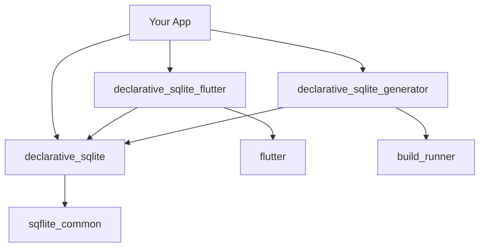

# Project Structure

Understanding how Declarative SQLite projects are organized and how the different packages work together.

## Repository Structure

The Declarative SQLite ecosystem consists of multiple packages in a monorepo structure:

```
declarative_sqlite/
├── declarative_sqlite/           # Core Dart package
│   ├── lib/
│   │   ├── declarative_sqlite.dart
│   │   └── src/
│   ├── example/
│   ├── test/
│   └── pubspec.yaml
├── declarative_sqlite_flutter/   # Flutter integration
│   ├── lib/
│   │   ├── declarative_sqlite_flutter.dart
│   │   └── src/
│   ├── example/
│   ├── test/
│   └── pubspec.yaml
├── declarative_sqlite_generator/  # Code generation
│   ├── lib/
│   │   └── declarative_sqlite_generator.dart
│   ├── build.yaml
│   └── pubspec.yaml
└── docs/                         # Documentation site
```

## Package Dependencies

Understanding how the packages depend on each other:



## Core Package (`declarative_sqlite`)

The foundation package that provides:

### Key Modules

- **Schema Definition** (`src/schema/`)
  - `SchemaBuilder` - Main entry point for schema definition
  - `TableBuilder` - Table definition with columns and constraints
  - `ColumnBuilder` - Column definition with types and modifiers
  - `IndexBuilder` - Index definition
  - `ViewBuilder` - SQL view definition

- **Database Operations** (`src/database/`)
  - `DeclarativeDatabase` - Main database interface
  - `DatabaseMigrator` - Schema migration logic
  - `QueryBuilder` - SQL query construction

- **Streaming** (`src/streaming/`)
  - `StreamingQuery` - Real-time query streaming
  - `ChangeNotifier` - Database change notifications

- **Sync** (`src/sync/`)
  - `SyncManager` - Synchronization with remote servers
  - `DirtyRowStore` - Offline change tracking
  - `ConflictResolver` - LWW conflict resolution

- **Files** (`src/files/`)
  - `FilesetField` - File attachment support
  - `FileRepository` - File storage and retrieval

### Public API Surface

```dart
// Main exports from declarative_sqlite.dart
export 'src/schema/schema_builder.dart';
export 'src/database/declarative_database.dart';
export 'src/streaming/streaming_query.dart';
export 'src/sync/sync_manager.dart';
export 'src/files/fileset_field.dart';
```

## Flutter Package (`declarative_sqlite_flutter`)

Flutter-specific widgets and utilities:

### Widget Categories

- **Query Widgets** (`src/widgets/query/`)
  - `QueryListView` - Reactive list views
  - `QueryBuilder` - Query result builders
  - `QueryStreamBuilder` - Stream-based widgets

- **Form Widgets** (`src/widgets/forms/`)
  - `DatabaseForm` - Auto-binding forms
  - `DatabaseTextField` - Text input fields
  - `DatabaseDropdown` - Selection widgets

- **Navigation** (`src/widgets/navigation/`)
  - `MasterDetailView` - Master-detail patterns
  - `DatabaseRouter` - Database-driven routing

### Design Principles

1. **Composable Widgets** - Small, focused, reusable components
2. **Stateless Preferred** - Stateless widgets when possible
3. **Flutter SDK Compatibility** - Same APIs as core Flutter widgets
4. **Reactive by Default** - Automatic UI updates on data changes

## Generator Package (`declarative_sqlite_generator`)

Code generation for type-safe database operations:

### Generated Code Types

- **Data Classes** - Type-safe representations of table rows
- **Query Builders** - Fluent query APIs
- **Repository Classes** - High-level data access layer

### Build Integration

```yaml
# build.yaml
targets:
  $default:
    builders:
      declarative_sqlite_generator|data_class_builder:
        enabled: true
        generate_for:
          - lib/schemas/**
```

## Typical Project Structure

Here's how a typical project using Declarative SQLite is organized:

### Flutter App Structure

```
my_flutter_app/
├── lib/
│   ├── main.dart
│   ├── database/
│   │   ├── schema.dart              # Database schema definition
│   │   └── database.dart            # Database initialization
│   ├── models/
│   │   ├── user.dart                # Generated data classes
│   │   ├── post.dart
│   │   └── comment.dart
│   ├── screens/
│   │   ├── home_screen.dart
│   │   ├── post_list_screen.dart    # Using QueryListView
│   │   └── user_profile_screen.dart
│   └── widgets/
│       ├── post_card.dart
│       └── user_avatar.dart
├── test/
├── pubspec.yaml
└── build.yaml                      # Generator configuration
```

### Example Schema File

```dart
// lib/database/schema.dart
import 'package:declarative_sqlite/declarative_sqlite.dart';

final appSchema = SchemaBuilder()
  .table('users', (table) => table
    .autoIncrementPrimaryKey('id')
    .text('username', (col) => col.notNull().unique())
    .text('email', (col) => col.notNull())
    .text('avatar_url')
    .date('created_at', (col) => col.notNull().defaultValue(DateTime.now())))
  .table('posts', (table) => table
    .autoIncrementPrimaryKey('id')
    .text('title', (col) => col.notNull())
    .text('content', (col) => col.notNull())
    .integer('user_id', (col) => col.notNull())
    .boolean('published', (col) => col.notNull().defaultValue(false))
    .date('created_at', (col) => col.notNull().defaultValue(DateTime.now()))
    .foreignKey('user_id').references('users', 'id'));
```

### Example Database Initialization

```dart
// lib/database/database.dart
import 'package:declarative_sqlite/declarative_sqlite.dart';
import 'schema.dart';

class AppDatabase {
  static DeclarativeDatabase? _instance;
  
  static Future<DeclarativeDatabase> get instance async {
    _instance ??= await DeclarativeDatabase.init(
      path: 'app.db',
      schema: appSchema,
    );
    return _instance!;
  }
}
```

## Version Compatibility

| Package | Min Dart SDK | Min Flutter SDK | SQLite Version |
|---------|--------------|-----------------|----------------|
| declarative_sqlite | 3.5.3 | N/A | 3.35+ |
| declarative_sqlite_flutter | 3.5.3 | 3.10.0 | 3.35+ |
| declarative_sqlite_generator | 3.5.3 | N/A | N/A |

## Development Workflow

1. **Define Schema** - Create your database schema using `SchemaBuilder`
2. **Generate Code** - Run `dart run build_runner build` to generate data classes
3. **Initialize Database** - Set up your database instance
4. **Build UI** - Use Flutter widgets to build reactive interfaces
5. **Test** - Write tests for your database operations and UI

## Best Practices

### Package Organization

- Keep schema definitions in a dedicated `database/` folder
- Separate generated code from hand-written code
- Use clear naming conventions for tables and columns
- Group related functionality in modules

### Dependency Management

- Pin package versions in production
- Use `dev_dependencies` for build-time tools
- Regularly update dependencies for security patches

### Testing Strategy

- Unit test your schema definitions
- Integration test database operations
- Widget test your Flutter components
- Use in-memory databases for testing

## Next Steps

- Learn about [Schema Definition](../core-library/schema-definition)
- Explore [Database Operations](../core-library/database-operations)
- Set up [Code Generation](../generator/setup)
- Build [Flutter Widgets](../flutter/widgets)